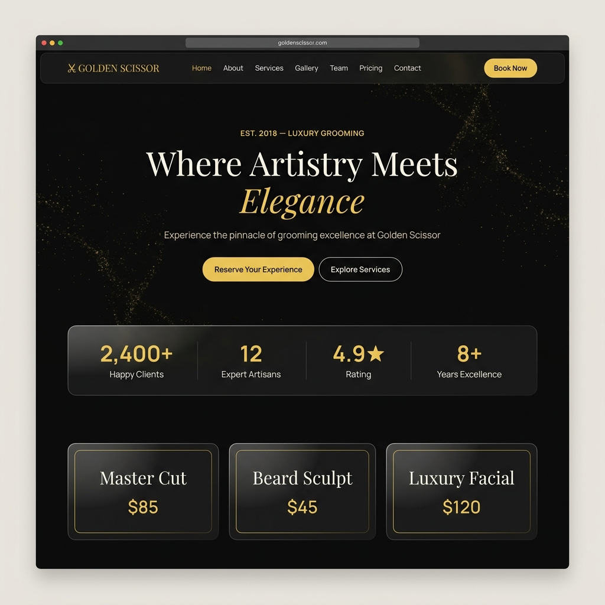

<div align="center">



# ✂️ Golden Scissor Spa & Saloon

**A full-stack luxury salon management platform built with the MERN stack.**
Pixel-perfect "Imperial Gilded Noir" design — Noir & Gold aesthetic with glass-morphism, smooth animations, and a complete booking ecosystem.

[](https://react.dev)
[](https://vitejs.dev)
[](https://nodejs.org)
[](https://mongodb.com)

</div>

---

## 🌟 Features

### 🎨 Customer-Facing Website
- **Home** — Animated hero with WebGL gold-particle canvas, stats bar, service previews
- **About** — Brand story & studio philosophy
- **Services** — Full service catalogue with categories & filters
- **Pricing** — Tiered pricing cards
- **Gallery** — Masonry photo gallery
- **Team** — Artisan profiles with specialties
- **Membership** — Loyalty membership plans
- **Offers** — Live promotional offers
- **Testimonials** — Client review carousel
- **Contact** — Contact form + map embed

### 📅 Booking System
- 4-step appointment wizard (Service → Staff → Date/Time → Confirm)
- Real-time slot availability checking
- Double-booking protection
- Email confirmation on booking

### 🔐 Authentication
- JWT in `httpOnly` cookies (secure, sameSite production flags)
- Register / Login / Forgot Password / Reset Password
- Role-based access: `customer` · `staff` · `admin`

### 👤 Customer Dashboard
- Upcoming & past bookings
- Wishlist / saved services
- Loyalty points tracker

### 🧑‍💼 Staff Portal
- Today's appointment schedule
- All-reservations table with status management
- Weekly availability editor

### ⚙️ Admin Dashboard
- KPI cards (revenue, bookings, clients, rating)
- Reservation control panel
- Concierge inquiry management

---

## 🛠️ Tech Stack

| Layer | Technology |
|-------|-----------|
| Frontend | React 19, Vite 8, React Router v7 |
| Styling | SCSS Modules, CSS animations |
| Fonts | Playfair Display · Manrope (Google Fonts) |
| Backend | Node.js, Express.js |
| Database | MongoDB + Mongoose ODM |
| Auth | JWT + httpOnly cookies |
| Media | Cloudinary (image upload) |
| Email | Nodemailer (Gmail SMTP) |
| Security | Helmet · rate-limit · xss-clean · mongo-sanitize |
| Deploy | Vercel (frontend) · Render (backend) |

---

## 🚀 Getting Started

### Prerequisites
- Node.js ≥ 18
- MongoDB Atlas account (free tier works)
- Cloudinary account (free tier)
- Gmail account (for email service)

### 1. Clone the repo
```bash
git clone https://github.com/siyamsenju-create/Golden_Scissor_Spa_Project.git
cd Golden_Scissor_Spa_Project
```

### 2. Backend setup
```bash
cd server
npm install
cp .env.example .env
# → Fill in your MONGO_URI, JWT_SECRET, Cloudinary & Email credentials
npm run dev
# Server starts on http://localhost:5000
```

### 3. Frontend setup
```bash
cd ../client
npm install
npm run dev
# App starts on http://localhost:5173
```

### 4. Seed sample data (optional)
```bash
cd server
node src/seed/seed.js
```

---

## 📁 Project Structure

```
golden-scissor-spa/
├── assets/                    # Screenshots & media
├── client/                    # React 19 + Vite frontend
│   └── src/
│       ├── App.jsx            # Root router (17 routes)
│       ├── styles/            # SCSS design tokens & globals
│       ├── components/common/ # Navbar, Footer, ConciergeWidget, WebGLBG
│       └── pages/             # All 17 pages + 3 dashboards
│
└── server/                    # Node.js + Express backend
    ├── server.js
    ├── .env.example
    └── src/
        ├── models/            # 10 Mongoose models
        ├── controllers/       # 11 REST controllers
        ├── routes/            # 12 route groups
        ├── middleware/        # Auth · RBAC · Error · Validation
        ├── services/          # Email service
        ├── config/            # DB + Cloudinary config
        └── seed/              # Sample data seeder
```

---

## 🌐 API Endpoints (Sample)

```
POST  /api/auth/register       Sign up new customer
POST  /api/auth/login          Authenticate & receive JWT cookie
GET   /api/auth/me             Get current user profile

GET   /api/services            List all services
GET   /api/staff               List all artisans
GET   /api/gallery             Fetch gallery images

POST  /api/bookings            Create appointment
PUT   /api/bookings/:id/status Update booking status

GET   /api/analytics/overview  Admin KPI summary
POST  /api/contact             Submit contact inquiry
GET   /api/reviews             Fetch client testimonials
```

---

## ☁️ Deployment

### Backend → Render.com
1. Create a **Web Service** from this repo
2. Root directory: `server/`
3. Build: `npm install` · Start: `node server.js`
4. Add all env vars from `.env.example`

### Frontend → Vercel
1. Import repo → root: `client/`
2. Framework preset: **Vite**
3. Add `VITE_API_URL=https://your-render-url.onrender.com`

---

## 🎨 Design System — "Imperial Gilded Noir"

| Token | Value | Usage |
|-------|-------|-------|
| Background | `#131313` | Page background |
| Gold | `#f2ca50` | Accents, CTAs |
| Surface | `#1c1b1b` | Cards & panels |
| Text | `#e5e2e1` | Primary text |
| Muted | `#d0c5af` | Secondary text |
| Heading | Playfair Display | Serif elegance |
| Body | Manrope | Clean readability |

---

## 📄 License

MIT — free to use for personal and commercial projects.

---

<div align="center">Built with ♥ for luxury grooming excellence</div>
